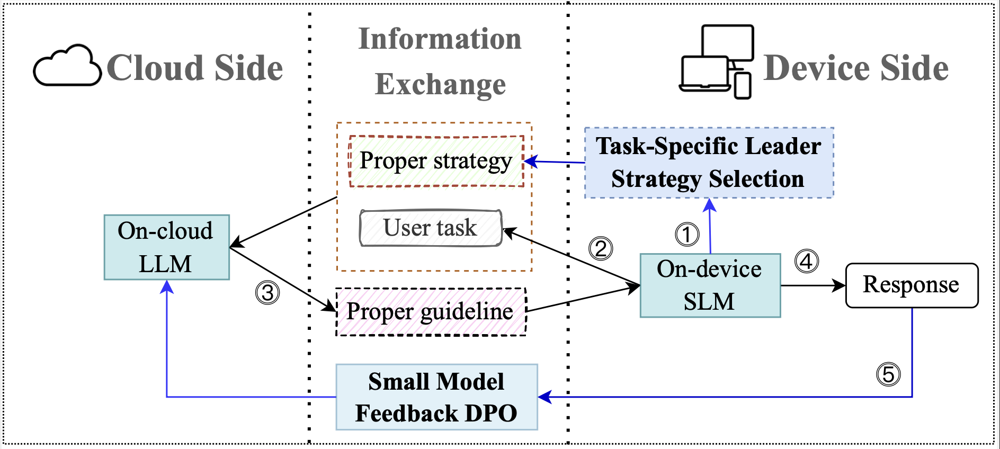

# LSRP

The source code of the paper: LSRP A Leader–Subordinate Retrival Framework for Privacy-Preserving Cloud–Device Collaboration.

## Highlights of the Paper

In this paper, we highlight our contributions as follows:

- We propose a leadership-style-based U-U-RAG generation method for cloud LLMs, leveraging RAG with users to dynamically select the most suitable leadership strategies for specific tasks.
- We introduce a feedback-driven optimization method for cloud LLMs based on the input of on-device SLMs, addressing a critical gap in optimizing cloud models within cloud-device collaborative frameworks.
- We conduct experiments on CoGen and Movie Explain datasets demonstrate the advantages of our proposed approach. And we open-source the Movie Explain dataset.

### Movie Explain Dataset

We provide the final dataset including `train/test.json` files located in `data/MovieExp`. Each sample is structured as follows:
```json
{
    "id": 960,
    "conversations": [
        {
            "from": "user",
            "value": "The movie 'Before the Flood' is recommended to the user. Please explain how the movie’s themes, characters, or storylines resonate with the user’s background, hobbies, or goals."
        },
        {
            "from": "assistant",
            "value": "As an environmental consultant, 'Before the Flood' is a compelling choice for you. This documentary, featuring Leonardo DiCaprio, explores the impacts of climate change across the globe, examining the political and societal intricacies associated with environmental issues. Given your educational background in Environmental Science and your Danish roots, this movie aligns well with your professional and personal interests. It offers a rich narrative that resonates with your commitment to sustainability, as highlighted in your Reddit writing style. The film's approach to raising awareness and encouraging action is likely to be both relatable and inspiring, supporting your habit of engaging in thought-provoking discussions online. Moreover, its relevance to global environmental policies provides a meaningful context for your social media activities, where you often share knowledge and insights on environmental topics."
        }
    ],
    "additional_profile": "age:36\nsex:female\ncity_country:Copenhagen, Denmark\nbirth_city_country:Copenhagen, Denmark\neducation:Masters in Environmental Science\noccupation:environmental consultant\nincome:300 thousand danish krone\nincome_level:middle\nrelationship_status:single\nstyle:Writing style: Your writing style on Reddit is casual yet articulate, reflecting your educational background and your Danish roots. You tend to use correct grammar and punctuation, but you're not overly formal, which shows your ability to adapt to the relaxed atmosphere of social media. You often incorporate environmental topics or references to Danish culture, which can be a subtle nod to your profession and heritage. You're not afraid to use emoticons or mild slang when it feels natural, but you generally keep things clear and concise. Your comments are thoughtful and you like to engage in discussions that allow you to share knowledge or learn from others.\n\nExample: oh, I totally get the struggle with formal events. I usually opt for something less prone to disaster, like a dark blouse. But hey, at least you've got a story to tell, right? 😅 On a side note, I've been pushing for more sustainable event planning in my line of work - less waste, more fun. Ever thought about suggesting a less 'white shirt' dress code? Could be a win-win for everyone!\nusername:JovialJay"
}
```

## The LSRP Framework


We propose two guideline-based leader-subordinate collaborative frameworks: a general leader strategy and four specific leader strategies.

You can easily run the framework using the following command:

```bash
run.sh
```

### Automatic Evaluation

We evaluate our models using the `gpt-4o` APIs.

```bash
python -u 4GPT_eval_relavance.py --file_name='./result/l+s+base/slm_response.json'
python -u 4GPT_eval_personal.py --file_name='./result/l+s+base/slm_response.json'
```